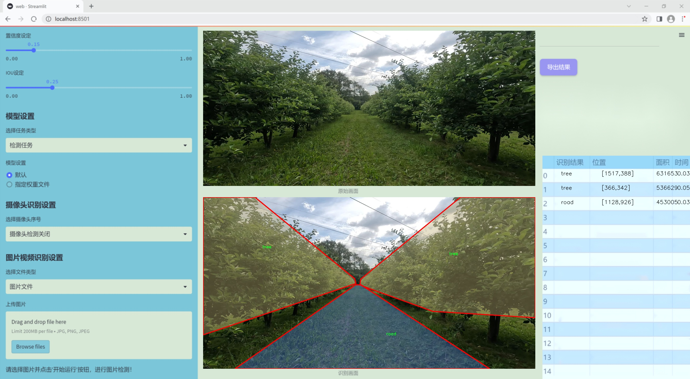
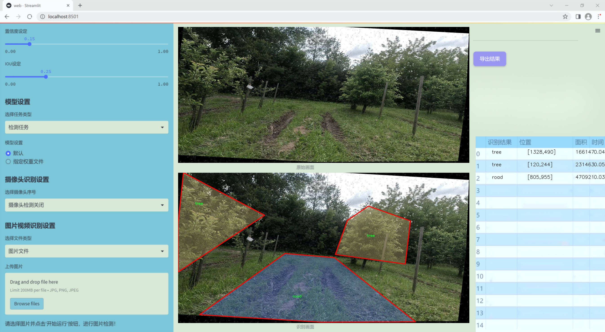
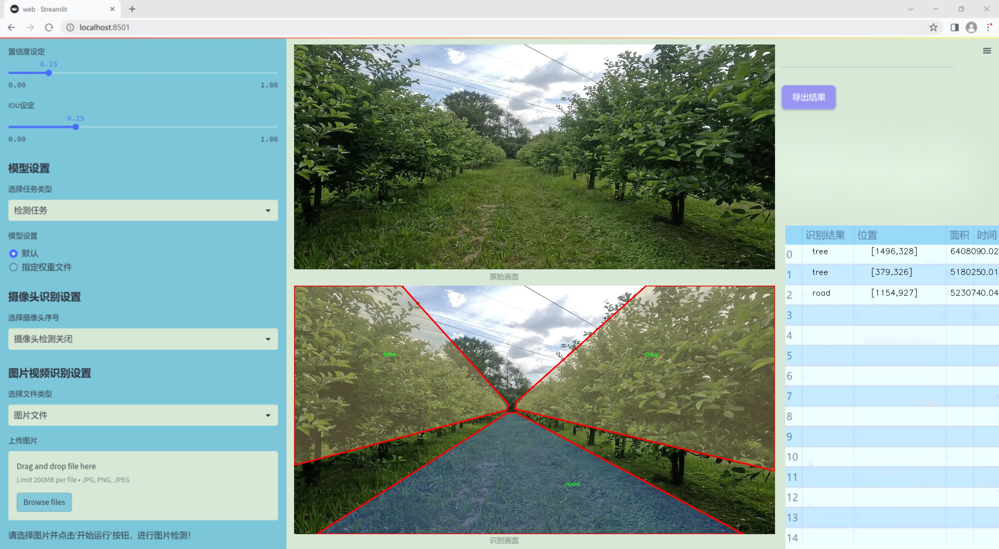
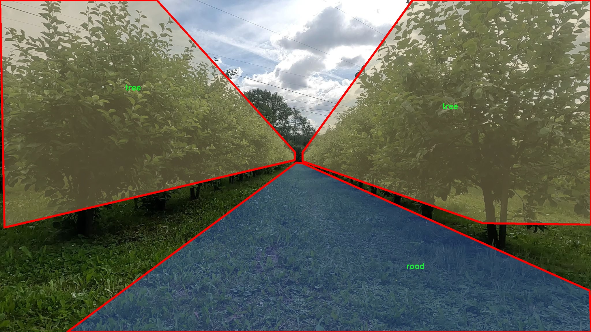
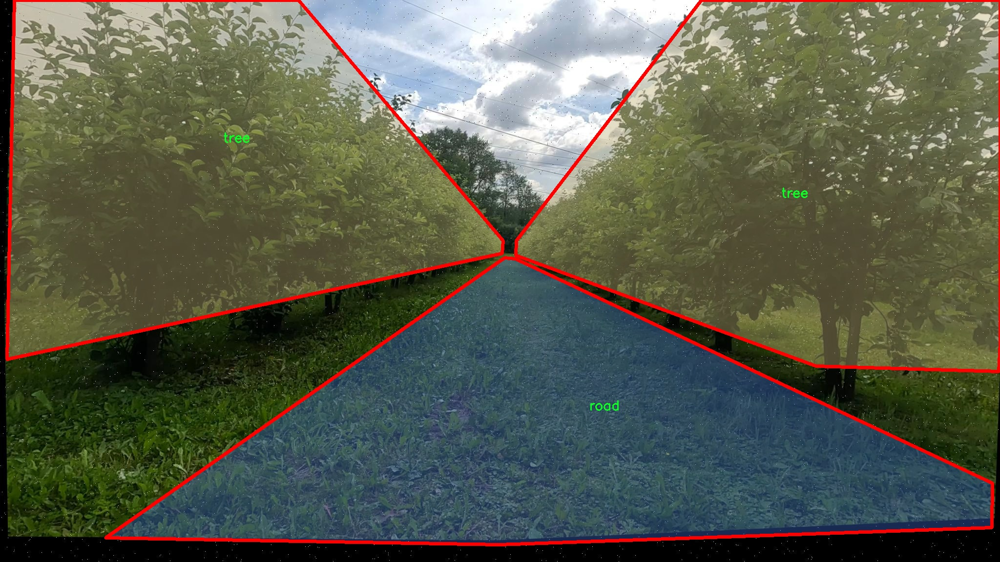
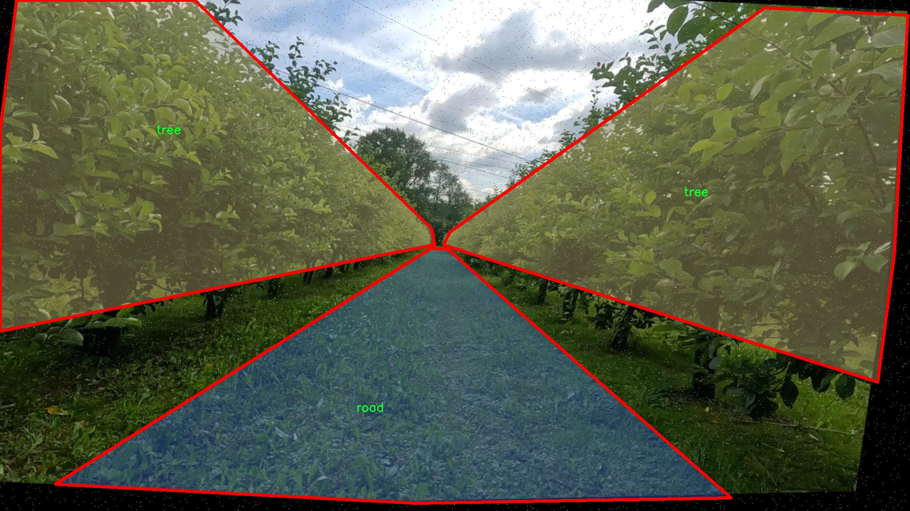
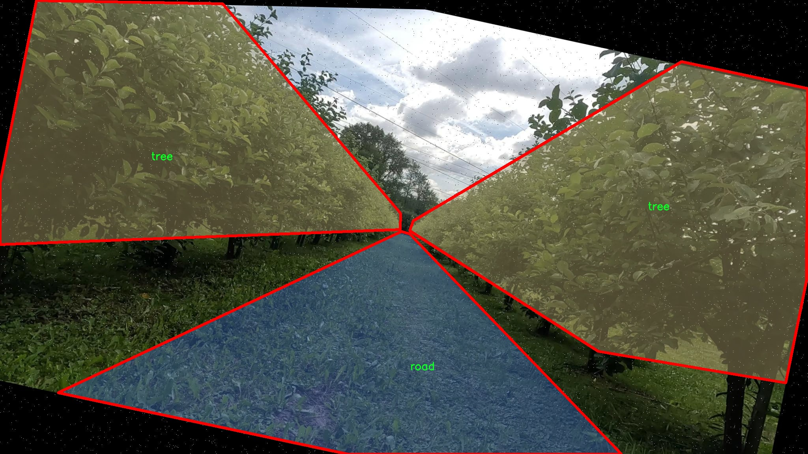
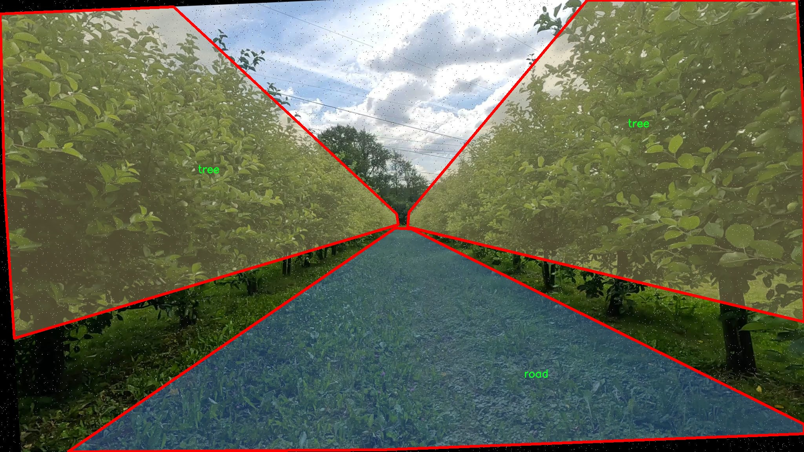

### 1.背景意义

研究背景与意义

随着城市化进程的加快，城市道路与绿化带的规划与管理变得愈发重要。道路与树木的实例分割不仅对城市环境的监测与管理有着重要意义，同时也为智能交通系统、环境保护及城市规划提供了重要的数据支持。近年来，深度学习技术的迅猛发展，尤其是目标检测与实例分割领域的进步，使得我们能够更高效地处理和分析图像数据。YOLO（You Only Look Once）系列模型因其高效性和准确性，成为了实例分割任务中的重要工具。

本研究旨在基于改进的YOLOv11模型，构建一个高效的道路与树木实例分割系统。该系统将利用一个包含1100张图像的专用数据集，数据集中涵盖了两类主要对象：道路和树木。通过对这些对象的精确分割，我们能够更好地理解城市环境中道路与绿化的分布特征，为后续的城市规划和环境保护提供科学依据。

在数据集的构建过程中，采用了多种数据增强技术，包括随机旋转、剪切、模糊处理及噪声添加等，这些技术不仅丰富了训练数据的多样性，也提高了模型的鲁棒性。通过这些预处理和增强手段，模型能够在更复杂的环境中保持良好的性能，从而提高实例分割的准确性。

综上所述，基于改进YOLOv11的道路与树木实例分割系统的研究，不仅为城市环境的智能监测提供了新思路，也为相关领域的研究提供了新的数据支持与技术手段。随着该系统的不断优化与完善，预计将为未来的城市管理与环境保护工作提供更加精准和高效的解决方案。

### 2.视频效果

[2.1 视频效果](https://www.bilibili.com/video/BV1E8kwYJExH/)

### 3.图片效果







##### [项目涉及的源码数据来源链接](https://kdocs.cn/l/cszuIiCKVNis)**

注意：本项目提供训练的数据集和训练教程,由于版本持续更新,暂不提供权重文件（best.pt）,请按照6.训练教程进行训练后实现上图演示的效果。

### 4.数据集信息

##### 4.1 本项目数据集类别数＆类别名

nc: 2
names: ['road', 'tree']


该项目为【图像分割】数据集，请在【训练教程和Web端加载模型教程（第三步）】这一步的时候按照【图像分割】部分的教程来训练

##### 4.2 本项目数据集信息介绍

本项目数据集信息介绍

本项目旨在改进YOLOv11的道路与树木实例分割系统，为此我们构建了一个专门的数据集，主题为“path_planing 2”。该数据集包含了两个主要类别，分别是“road”（道路）和“tree”（树木），这两个类别在城市和乡村环境中都具有重要的应用价值。通过对这些类别的精确识别与分割，我们能够为自动驾驶、城市规划以及环境监测等领域提供强有力的数据支持。

数据集的构建过程涵盖了多种场景和条件，以确保模型在不同环境下的鲁棒性。我们收集了来自不同地理位置的图像，包括城市街道、乡村小路以及公园等场所，确保数据集的多样性和代表性。在图像标注过程中，采用了高精度的标注工具，确保每一幅图像中的道路和树木都得到了准确的分割。这一过程不仅提升了数据集的质量，也为后续的模型训练奠定了坚实的基础。

在数据集的数量方面，我们确保了每个类别的样本量均衡，以避免模型在训练过程中出现偏差。通过对数据集的细致分析，我们发现道路和树木的分布特征各具特色，这为模型的学习提供了丰富的信息。最终，我们的数据集不仅具备了良好的数量基础，还在类别多样性和环境适应性上表现出色，为改进YOLOv11的实例分割能力提供了强有力的支持。

通过这一数据集的应用，我们期望能够显著提升YOLOv11在道路与树木实例分割任务中的性能，使其在实际应用中更具实用性和准确性。我们相信，这一数据集将为相关研究和应用的发展开辟新的可能性。











### 5.全套项目环境部署视频教程（零基础手把手教学）

[5.1 所需软件PyCharm和Anaconda安装教程（第一步）](https://www.bilibili.com/video/BV1BoC1YCEKi/?spm_id_from=333.999.0.0&vd_source=bc9aec86d164b67a7004b996143742dc)


[5.2 安装Python虚拟环境创建和依赖库安装视频教程（第二步）](https://www.bilibili.com/video/BV1ZoC1YCEBw?spm_id_from=333.788.videopod.sections&vd_source=bc9aec86d164b67a7004b996143742dc)

### 6.改进YOLOv11训练教程和Web_UI前端加载模型教程（零基础手把手教学）

[6.1 改进YOLOv11训练教程和Web_UI前端加载模型教程（第三步）](https://www.bilibili.com/video/BV1BoC1YCEhR?spm_id_from=333.788.videopod.sections&vd_source=bc9aec86d164b67a7004b996143742dc)


按照上面的训练视频教程链接加载项目提供的数据集，运行train.py即可开始训练



     Epoch   gpu_mem       box       obj       cls    labels  img_size
     1/200     20.8G   0.01576   0.01955  0.007536        22      1280: 100%|██████████| 849/849 [14:42<00:00,  1.04s/it]
               Class     Images     Labels          P          R     mAP@.5 mAP@.5:.95: 100%|██████████| 213/213 [01:14<00:00,  2.87it/s]
                 all       3395      17314      0.994      0.957      0.0957      0.0843

     Epoch   gpu_mem       box       obj       cls    labels  img_size
     2/200     20.8G   0.01578   0.01923  0.007006        22      1280: 100%|██████████| 849/849 [14:44<00:00,  1.04s/it]
               Class     Images     Labels          P          R     mAP@.5 mAP@.5:.95: 100%|██████████| 213/213 [01:12<00:00,  2.95it/s]
                 all       3395      17314      0.996      0.956      0.0957      0.0845

     Epoch   gpu_mem       box       obj       cls    labels  img_size
     3/200     20.8G   0.01561    0.0191  0.006895        27      1280: 100%|██████████| 849/849 [10:56<00:00,  1.29it/s]
               Class     Images     Labels          P          R     mAP@.5 mAP@.5:.95: 100%|███████   | 187/213 [00:52<00:00,  4.04it/s]
                 all       3395      17314      0.996      0.957      0.0957      0.0845


###### [项目数据集下载链接](https://kdocs.cn/l/cszuIiCKVNis)

### 7.原始YOLOv11算法讲解

YOLOv11是一种由Ultralytics公司开发的最新一代目标检测模型，以其增强的特征提取能力和更高的效率在计算机视觉领域引人注目。该模型在架构上进行了关键升级，通过更新主干和颈部结构，显著提高了对复杂视觉场景的理解和处理精度。YOLOv11不仅在目标检测上表现出色，还支持实例分割、图像分类、姿态估计和定向目标检测（OBB）等任务，展示出其多功能性。

与其前身YOLOv8相比，YOLOv11在设计上实现了深度和宽度的改变，同时引入了几个创新机制。其中，C3k2机制是对YOLOv8中的C2f的改进，提升了浅层特征的处理能力；C2PSA机制则进一步优化了特征图的处理流程。解耦头的创新设计，通过增加两个深度卷积（DWConv），提高了模型对细节的感知能力和分类准确性。

在性能上，YOLOv11m模型在COCO数据集上的平均精度（mAP）提高，并减少了22%的参数量，确保了在运算效率上的突破。该模型可以部署在多种平台上，包括边缘设备、云平台以及支持NVIDIA GPU的系统，彰显出卓越的灵活性和适应性。总体而言，YOLOv11通过一系列的创新突破，对目标检测领域产生了深远的影响，并为未来的开发提供了新的研究方向。


****文档**** ： _ _https://docs.ultralytics.com/models/yolo11/__

****代码链接**** ： _ _https://github.com/ultralytics/ultralytics__

******Performance Metrics******


​ ** **关键特性****

****◆**** ** **增强的特征提取能力**** ：YOLO11采用了改进的主干和颈部架构，增强了 ** **特征提取****
能力，能够实现更精确的目标检测和复杂任务的执行。

****◆**** ** **优化的效率和速度****
：YOLO11引入了精细化的架构设计和优化的训练流程，提供更快的处理速度，并在准确性和性能之间保持最佳平衡。

****◆**** ** **参数更少、精度更高****
：通过模型设计的改进，YOLO11m在COCO数据集上实现了更高的平均精度（mAP），同时使用的参数比YOLOv8m少22%，使其在计算上更加高效，而不牺牲准确性。

****◆**** ** **跨环境的适应性**** ：YOLO11可以无缝部署在各种环境中，包括边缘设备、云平台和支持NVIDIA
GPU的系统，确保最大的灵活性。

****◆**** ** **支持广泛任务****
：无论是目标检测、实例分割、图像分类、姿态估计还是定向目标检测（OBB），YOLO11都旨在应对一系列计算机视觉挑战。

****支持的任务和模式****


​YOLO11建立在YOLOv8中引入的多功能模型范围之上，为各种计算机视觉任务提供增强的支持:


​该表提供了YOLO11模型变体的概述，展示了它们在特定任务中的适用性以及与Inference、Validation、Training和Export等操作模式的兼容性。从实时检测到复杂的分割任务
，这种灵活性使YOLO11适用于计算机视觉的广泛应用。

##### yolov11的创新

■ yolov8 VS yolov11

YOLOv5，YOLOv8和YOLOv11均是ultralytics公司的作品，ultralytics出品必属精品。


​ **具体创新点** ：

**① 深度（depth）和宽度 （width）**

YOLOv8和YOLOv11是基本上完全不同。

**② C3k2机制**

C3k2有参数为c3k，其中在网络的浅层c3k设置为False。C3k2就相当于YOLOv8中的C2f。


​ **③ C2PSA机制**

下图为C2PSA机制的原理图。


​ **④ 解耦头**

解耦头中的分类检测头增加了两个 **DWConv** 。


▲Conv

    
    
    def autopad(k, p=None, d=1):  # kernel, padding, dilation
    
        """Pad to 'same' shape outputs."""
    
        if d > 1:
    
            k = d * (k - 1) + 1 if isinstance(k, int) else [d * (x - 1) + 1 for x in k]  # actual kernel-size
    
        if p is None:
    
            p = k // 2 if isinstance(k, int) else [x // 2 for x in k]  # auto-pad
    
    return p
    
    
    class Conv(nn.Module):
    
        """Standard convolution with args(ch_in, ch_out, kernel, stride, padding, groups, dilation, activation)."""
    
    
        default_act = nn.SiLU()  # default activation
    
    
        def __init__(self, c1, c2, k=1, s=1, p=None, g=1, d=1, act=True):
    
            """Initialize Conv layer with given arguments including activation."""
    
            super().__init__()
    
            self.conv = nn.Conv2d(c1, c2, k, s, autopad(k, p, d), groups=g, dilation=d, bias=False)
    
            self.bn = nn.BatchNorm2d(c2)
    
            self.act = self.default_act if act is True else act if isinstance(act, nn.Module) else nn.Identity()
    
    
        def forward(self, x):
    
            """Apply convolution, batch normalization and activation to input tensor."""
    
            return self.act(self.bn(self.conv(x)))
    
    
        def forward_fuse(self, x):
    
            """Perform transposed convolution of 2D data."""
    
            return self.act(self.conv(x))

▲Conv2d

    
    
    torch.nn.Conv2d(in_channels, out_channels, kernel_size, stride=1, padding=0, dilation=1, groups=1, bias=True, padding_mode='zeros')

▲DWConv

DWConv ** **代表 Depthwise Convolution（深度卷积）****
，是一种在卷积神经网络中常用的高效卷积操作。它主要用于减少计算复杂度和参数量。

    
    
    class DWConv(Conv):
    
        """Depth-wise convolution."""
    
    
        def __init__(self, c1, c2, k=1, s=1, d=1, act=True):  # ch_in, ch_out, kernel, stride, dilation, activation
    
            """Initialize Depth-wise convolution with given parameters."""
    
            super().__init__(c1, c2, k, s, g=math.gcd(c1, c2), d=d, act=act)


### 8.200+种全套改进YOLOV11创新点原理讲解

#### 8.1 200+种全套改进YOLOV11创新点原理讲解大全

由于篇幅限制，每个创新点的具体原理讲解就不全部展开，具体见下列网址中的改进模块对应项目的技术原理博客网址【Blog】（创新点均为模块化搭建，原理适配YOLOv5~YOLOv11等各种版本）

[改进模块技术原理博客【Blog】网址链接](https://gitee.com/qunmasj/good)


#### 8.2 精选部分改进YOLOV11创新点原理讲解

###### 这里节选部分改进创新点展开原理讲解(完整的改进原理见上图和[改进模块技术原理博客链接](https://gitee.com/qunmasj/good)【如果此小节的图加载失败可以通过CSDN或者Github搜索该博客的标题访问原始博客，原始博客图片显示正常】


### Context_Grided_Network(CGNet)简介
参考该博客提出的一种轻量化语义分割模型Context Grided Network(CGNet)，以满足设备的运行需要。

CGNet主要由CG块构建而成，CG块可以学习局部特征和周围环境上下文的联合特征，最后通过引入全局上下文特征进一步改善联合特征的学习。


 
下图给出了在Cityscapes数据集上对现有的一些语义分割模型的测试效果，横轴表示参数量，纵轴表示准确率(mIoU)。可以看出，在参数量较少的情况下，CGNet可以达到一个比较好的准确率。虽与高精度模型相去甚远，但在一些对精度要求不高、对实时性要求比较苛刻的情况下，很有价值。


高精度模型，如DeepLab、DFN、DenseASPP等，动不动就是几十M的参数，很难应用在移动设备上。而上图中红色的模型，相对内存占用较小，但它们的分割精度却不是很高。作者认为主要原因是，这些小网络大多遵循着分类网络的设计思路，并没有考虑语义分割任务更深层次的特点。

空间依赖性和上下文信息对提高分割精度有很大的作用。作者从该角度出发，提出了CG block，并进一步搭建了轻量级语义分割网络CGNet。CG块具有以下特点： 

学习局部特征和上下文特征的联合特征；
通过全局上下文特征改进上述联合特征；
可以贯穿应用在整个网络中，从low level（空间级别）到high level（语义级别）。不像PSPNet、DFN、DenseASPP等，只在编码阶段以后捕捉上下文特征。；
只有3个下采样，相比一般5个下采样的网络，能够更好地保留边缘信息。
CGNet遵循“深而薄”的原则设计，整个网络又51层构成。其中，为了降低计算，大量使用了channel-wise conv.

小型语义分割模型：

需要平衡准确率和系统开销
进化路线：ENet -> ICNet -> ESPNet
这些模型基本都基于分类网络设计，在分割准确率上效果并不是很好
上下文信息模型：

大多数现有模型只考虑解码阶段的上下文信息并且没有利用周围的上下文信息
注意力机制：

CG block使用全局上下文信息计算权重向量，并使用其细化局部特征和周围上下文特征的联合特征

#### Context Guided Block
CG block由4部分组成：


此外，CG block还采用了残差学习。文中提出了局部残差学习（LRL）和全局残差学习（GRL）两种方式。 LRL添加了从输入到联合特征提取器的连接，GRL添加了从输入到全局特征提取器的连接。从直观上来说，GRL比LRL更能促进网络中的信息传递（更像ResNet~~），后面实验部分也进行了测试，的确GRL更能提升分割精度。


CGNet的通用网络结构如下图所示，分为3个stage，第一个stage使用3个卷积层抽取特征，第二和第三个stage堆叠一定数量的CG block，具体个数可以根据情况调整。最后，通过1x1 conv得到分割结果。


下图是用于Cityscapes数据集的CGNet网络细节说明：输入尺寸为3*680*680；stage1连续使用了3个Conv-BN-PReLU组合，首个组合使用了stride=2的卷积，所以得到了1/2分辨率的feature map；stage2和stage3分别使用了多个CG block，且其中使用了不同大小的膨胀卷积核，最终分别得到了1/4和1/8的feature map。

需注意：

stage2&3的输入特征分别由其上一个stage的首个和最后一个block组合给出（参考上图的绿色箭头）；

输入注入机制，图中未体现，实际使用中，作者还将输入图像下采样1/4或1/8，分别给到stage2和stage3的输入中 ，以进一步加强特征传递。

channel-wise conv。为了缩减参数数量，在局部特征提取器和周围上下文特征提取器中使用了channel-wise卷积，可以消除跨通道的计算成本，同时节省内存占用。但是，没有像MobileNet等模型一样，在depth-wise卷积后面接point-wise卷积（1*1 conv），作者解释是，因为CG block需要保持局部特征和周围上下文特征的独立性，而1*1 conv会破坏这种独立性，所以效果欠佳，实验部分也进行了验证。

个人感觉此处应该指的是depth-wise卷积？

官方Git中对该部分的实现如下：


### 9.系统功能展示

图9.1.系统支持检测结果表格显示

  图9.2.系统支持置信度和IOU阈值手动调节

  图9.3.系统支持自定义加载权重文件best.pt(需要你通过步骤5中训练获得)

  图9.4.系统支持摄像头实时识别

  图9.5.系统支持图片识别

  图9.6.系统支持视频识别

  图9.7.系统支持识别结果文件自动保存

  图9.8.系统支持Excel导出检测结果数据


### 10. YOLOv11核心改进源码讲解

#### 10.1 rep_block.py

以下是对代码的核心部分进行分析和详细注释的结果。代码的主要功能是实现一个多分支卷积块（DiverseBranchBlock），该模块结合了多种卷积操作和批归一化（Batch Normalization），以提高神经网络的表现。我们将保留主要的类和函数，并添加详细的中文注释。

```python
import torch
import torch.nn as nn
import torch.nn.functional as F
import numpy as np

# 定义用于转换和融合卷积核和偏置的函数
def transI_fusebn(kernel, bn):
    # 融合卷积核和批归一化的权重和偏置
    gamma = bn.weight  # 获取批归一化的权重
    std = (bn.running_var + bn.eps).sqrt()  # 计算标准差
    return kernel * ((gamma / std).reshape(-1, 1, 1, 1)), bn.bias - bn.running_mean * gamma / std

def conv_bn(in_channels, out_channels, kernel_size, stride=1, padding=0, dilation=1, groups=1):
    # 创建一个卷积层和一个批归一化层的组合
    conv_layer = nn.Conv2d(in_channels=in_channels, out_channels=out_channels, kernel_size=kernel_size,
                           stride=stride, padding=padding, dilation=dilation, groups=groups,
                           bias=False)  # 不使用偏置
    bn_layer = nn.BatchNorm2d(num_features=out_channels, affine=True)  # 创建批归一化层
    return nn.Sequential(conv_layer, bn_layer)  # 返回一个顺序容器

class DiverseBranchBlock(nn.Module):
    def __init__(self, in_channels, out_channels, kernel_size, stride=1, padding=None, dilation=1, groups=1):
        super(DiverseBranchBlock, self).__init__()
        
        self.kernel_size = kernel_size
        self.in_channels = in_channels
        self.out_channels = out_channels
        self.groups = groups
        
        # 计算填充
        if padding is None:
            padding = kernel_size // 2  # 默认填充为核大小的一半
        assert padding == kernel_size // 2

        # 定义原始卷积和批归一化层
        self.dbb_origin = conv_bn(in_channels=in_channels, out_channels=out_channels, kernel_size=kernel_size,
                                  stride=stride, padding=padding, dilation=dilation, groups=groups)

        # 定义平均池化和批归一化层
        self.dbb_avg = nn.Sequential(
            nn.Conv2d(in_channels=in_channels, out_channels=out_channels, kernel_size=1, stride=1, padding=0, groups=groups, bias=False),
            nn.BatchNorm2d(out_channels),
            nn.AvgPool2d(kernel_size=kernel_size, stride=stride, padding=0)
        )

        # 定义1x1卷积和3x3卷积的组合
        self.dbb_1x1_kxk = nn.Sequential(
            nn.Conv2d(in_channels=in_channels, out_channels=out_channels, kernel_size=1, stride=1, padding=0, groups=groups, bias=False),
            nn.BatchNorm2d(out_channels),
            nn.Conv2d(in_channels=out_channels, out_channels=out_channels, kernel_size=kernel_size, stride=stride, padding=0, groups=groups, bias=False),
            nn.BatchNorm2d(out_channels)
        )

    def forward(self, inputs):
        # 前向传播
        out = self.dbb_origin(inputs)  # 原始卷积输出
        out += self.dbb_avg(inputs)  # 加上平均池化输出
        out += self.dbb_1x1_kxk(inputs)  # 加上1x1和3x3卷积的输出
        return out  # 返回最终输出

# 其他类（如WideDiverseBranchBlock, DeepDiverseBranchBlock等）可以根据需要进行类似的简化和注释
```

### 主要功能说明
1. **transI_fusebn**: 该函数用于将卷积层的权重与批归一化层的权重融合，计算出新的卷积核和偏置。
2. **conv_bn**: 创建一个包含卷积层和批归一化层的顺序容器，方便后续使用。
3. **DiverseBranchBlock**: 这是一个核心模块，包含多个分支的卷积操作，通过不同的卷积核和池化操作来提取特征。它在前向传播中将不同分支的输出相加。

### 总结
以上代码实现了一个复杂的卷积模块，能够在不同的分支上进行特征提取。通过融合卷积和批归一化，能够有效提高模型的性能。可以根据具体需求进一步简化或扩展其他类的实现。

该文件 `rep_block.py` 定义了一些用于构建深度学习模型的模块，主要集中在多分支卷积块的实现上。这些模块的设计旨在提高卷积神经网络的表现，尤其是在处理图像时。以下是对文件中主要内容的逐步分析。

首先，文件导入了必要的库，包括 PyTorch 和 NumPy。接着，定义了一些工具函数，这些函数用于处理卷积和批归一化（Batch Normalization）层的参数，帮助在不同的网络结构中进行参数融合和转换。

`transI_fusebn` 函数用于将卷积层的权重与其后面的批归一化层的参数融合。它返回融合后的卷积核和偏置。其他的转换函数如 `transII_addbranch`、`transIII_1x1_kxk`、`transIV_depthconcat` 和 `transV_avg` 也分别用于不同的参数处理需求，例如合并多个卷积核、进行深度拼接和生成平均卷积核等。

接下来，定义了几个类，其中 `IdentityBasedConv1x1` 类实现了带有身份映射的 1x1 卷积层。这个类在初始化时会创建一个身份矩阵，并在前向传播时将其与卷积权重相加，以实现身份映射的效果。

`BNAndPadLayer` 类则结合了批归一化和填充操作。它在前向传播时首先进行批归一化，然后根据需要进行填充，以确保输出的尺寸符合要求。

`DiverseBranchBlock` 类是文件的核心部分之一，它实现了一个多分支卷积块。这个类可以根据输入的参数配置不同的卷积结构，包括标准卷积、平均池化和 1x1 卷积等。它还支持部署模式下的参数重参数化，以便在推理时提高效率。

`DiverseBranchBlockNOAct` 类是一个不包含非线性激活函数的多分支卷积块，适用于某些特定的网络结构需求。

`DeepDiverseBranchBlock` 和 `WideDiverseBranchBlock` 类则是在 `DiverseBranchBlock` 的基础上进行了扩展，分别实现了更深和更宽的多分支卷积块。它们增加了对不同卷积核形状的支持，并在前向传播中融合了多个卷积层的输出。

整个文件的设计体现了对卷积神经网络模块化和灵活性的追求，使得在构建复杂的网络结构时可以方便地组合不同的卷积块。同时，文件中的参数融合和重参数化策略有助于在推理阶段提高模型的效率。

#### 10.2 starnet.py

以下是代码中最核心的部分，并附上详细的中文注释：

```python
import torch
import torch.nn as nn
from timm.models.layers import DropPath, trunc_normal_

class ConvBN(torch.nn.Sequential):
    """
    定义一个卷积层后接批归一化的模块
    """
    def __init__(self, in_planes, out_planes, kernel_size=1, stride=1, padding=0, dilation=1, groups=1, with_bn=True):
        super().__init__()
        # 添加卷积层
        self.add_module('conv', torch.nn.Conv2d(in_planes, out_planes, kernel_size, stride, padding, dilation, groups))
        # 如果需要，添加批归一化层
        if with_bn:
            self.add_module('bn', torch.nn.BatchNorm2d(out_planes))
            # 初始化批归一化的权重和偏置
            torch.nn.init.constant_(self.bn.weight, 1)
            torch.nn.init.constant_(self.bn.bias, 0)

class Block(nn.Module):
    """
    StarNet中的基本模块，包含深度卷积和元素级乘法
    """
    def __init__(self, dim, mlp_ratio=3, drop_path=0.):
        super().__init__()
        # 深度卷积层
        self.dwconv = ConvBN(dim, dim, 7, 1, (7 - 1) // 2, groups=dim, with_bn=True)
        # 两个1x1卷积层，用于特征变换
        self.f1 = ConvBN(dim, mlp_ratio * dim, 1, with_bn=False)
        self.f2 = ConvBN(dim, mlp_ratio * dim, 1, with_bn=False)
        # 将特征映射回原始维度的卷积层
        self.g = ConvBN(mlp_ratio * dim, dim, 1, with_bn=True)
        # 第二个深度卷积层
        self.dwconv2 = ConvBN(dim, dim, 7, 1, (7 - 1) // 2, groups=dim, with_bn=False)
        self.act = nn.ReLU6()  # 激活函数
        self.drop_path = DropPath(drop_path) if drop_path > 0. else nn.Identity()  # 随机深度

    def forward(self, x):
        input = x  # 保存输入
        x = self.dwconv(x)  # 经过深度卷积
        x1, x2 = self.f1(x), self.f2(x)  # 特征变换
        x = self.act(x1) * x2  # 元素级乘法
        x = self.dwconv2(self.g(x))  # 经过第二个深度卷积
        x = input + self.drop_path(x)  # 残差连接
        return x

class StarNet(nn.Module):
    """
    StarNet模型的定义
    """
    def __init__(self, base_dim=32, depths=[3, 3, 12, 5], mlp_ratio=4, drop_path_rate=0.0, num_classes=1000, **kwargs):
        super().__init__()
        self.num_classes = num_classes
        self.in_channel = 32
        # stem层，用于初始特征提取
        self.stem = nn.Sequential(ConvBN(3, self.in_channel, kernel_size=3, stride=2, padding=1), nn.ReLU6())
        dpr = [x.item() for x in torch.linspace(0, drop_path_rate, sum(depths))]  # 随机深度
        # 构建各个阶段
        self.stages = nn.ModuleList()
        cur = 0
        for i_layer in range(len(depths)):
            embed_dim = base_dim * 2 ** i_layer  # 当前阶段的特征维度
            down_sampler = ConvBN(self.in_channel, embed_dim, 3, 2, 1)  # 下采样层
            self.in_channel = embed_dim
            blocks = [Block(self.in_channel, mlp_ratio, dpr[cur + i]) for i in range(depths[i_layer])]  # 当前阶段的Block
            cur += depths[i_layer]
            self.stages.append(nn.Sequential(down_sampler, *blocks))  # 将下采样层和Block组合成一个阶段
        
        self.apply(self._init_weights)  # 初始化权重

    def _init_weights(self, m):
        """
        权重初始化
        """
        if isinstance(m, (nn.Linear, nn.Conv2d)):
            trunc_normal_(m.weight, std=.02)  # 截断正态分布初始化
            if isinstance(m, nn.Linear) and m.bias is not None:
                nn.init.constant_(m.bias, 0)  # 偏置初始化为0
        elif isinstance(m, (nn.LayerNorm, nn.BatchNorm2d)):
            nn.init.constant_(m.bias, 0)  # 偏置初始化为0
            nn.init.constant_(m.weight, 1.0)  # 权重初始化为1.0

    def forward(self, x):
        """
        前向传播
        """
        features = []
        x = self.stem(x)  # 经过stem层
        features.append(x)  # 保存特征
        for stage in self.stages:
            x = stage(x)  # 经过每个阶段
            features.append(x)  # 保存特征
        return features  # 返回所有阶段的特征

# 模型构建函数
def starnet_s1(pretrained=False, **kwargs):
    model = StarNet(24, [2, 2, 8, 3], **kwargs)  # 创建StarNet模型
    return model

def starnet_s2(pretrained=False, **kwargs):
    model = StarNet(32, [1, 2, 6, 2], **kwargs)
    return model

def starnet_s3(pretrained=False, **kwargs):
    model = StarNet(32, [2, 2, 8, 4], **kwargs)
    return model

def starnet_s4(pretrained=False, **kwargs):
    model = StarNet(32, [3, 3, 12, 5], **kwargs)
    return model
```

### 代码说明：
1. **ConvBN类**：定义了一个包含卷积层和批归一化层的模块，便于后续构建网络。
2. **Block类**：StarNet的基本构建块，包含深度卷积、特征变换和元素级乘法，使用残差连接。
3. **StarNet类**：整个网络的定义，包含多个阶段，每个阶段由下采样层和多个Block组成。
4. **权重初始化**：使用截断正态分布对卷积层和线性层的权重进行初始化，确保模型训练的稳定性。
5. **前向传播**：通过stem层和各个阶段提取特征，返回每个阶段的特征图。

这个程序文件实现了一个名为StarNet的深度学习网络模型，主要用于图像处理任务。文件开头的文档字符串简要说明了StarNet的设计理念，强调了其简化的结构，特别是元素级乘法的关键贡献。该模型没有使用层级缩放和训练过程中的指数移动平均（EMA），这些通常可以提高模型性能。

程序首先导入了必要的库，包括PyTorch和一些用于构建模型的模块。接着定义了一个包含多个预训练模型链接的字典，便于后续加载不同版本的StarNet模型。

在代码中，`ConvBN`类是一个组合模块，包含卷积层和批归一化层。它的构造函数接受多个参数以配置卷积操作，并在必要时添加批归一化层。该类的设计使得在构建网络时可以方便地使用卷积和批归一化。

`Block`类是StarNet的基本构建块，包含多个卷积层和激活函数。它使用深度可分离卷积（depthwise convolution）和元素级乘法来处理输入数据。`forward`方法定义了数据在该块中的流动方式，包括输入的跳跃连接和随机丢弃路径的应用。

`StarNet`类是整个网络的主体，构造函数中定义了网络的结构，包括输入层、多个阶段和每个阶段的块。通过逐层构建，网络可以处理不同维度的特征图。初始化权重的方法确保网络的参数在训练开始时处于合理的状态。

接下来的函数`starnet_s1`到`starnet_s4`分别定义了不同规模的StarNet模型，允许用户选择不同的网络深度和宽度。每个函数都可以选择加载预训练的权重，便于在特定任务上进行微调。

最后，`starnet_s050`、`starnet_s100`和`starnet_s150`函数提供了更小规模的网络选项，适合资源受限的环境或需要快速推理的场景。

总体而言，这个程序文件展示了StarNet的结构和功能，强调了其设计的简洁性和高效性，适合用于图像分类等任务。

#### 10.3 fasternet.py

以下是经过简化和注释的核心代码部分，主要包含了FasterNet模型的定义及其关键组件的实现。

```python
import torch
import torch.nn as nn
from typing import List
from torch import Tensor

class PartialConv3(nn.Module):
    """部分卷积层，用于处理输入特征图的部分通道"""
    
    def __init__(self, dim, n_div, forward):
        super().__init__()
        self.dim_conv3 = dim // n_div  # 计算部分卷积的通道数
        self.dim_untouched = dim - self.dim_conv3  # 计算未被卷积处理的通道数
        self.partial_conv3 = nn.Conv2d(self.dim_conv3, self.dim_conv3, 3, 1, 1, bias=False)  # 定义卷积层

        # 根据前向传播方式选择不同的前向函数
        if forward == 'slicing':
            self.forward = self.forward_slicing
        elif forward == 'split_cat':
            self.forward = self.forward_split_cat
        else:
            raise NotImplementedError

    def forward_slicing(self, x: Tensor) -> Tensor:
        """仅用于推理阶段的前向传播"""
        x = x.clone()  # 保持原始输入不变，以便后续的残差连接
        x[:, :self.dim_conv3, :, :] = self.partial_conv3(x[:, :self.dim_conv3, :, :])  # 处理部分通道
        return x

    def forward_split_cat(self, x: Tensor) -> Tensor:
        """用于训练和推理阶段的前向传播"""
        x1, x2 = torch.split(x, [self.dim_conv3, self.dim_untouched], dim=1)  # 分割输入特征图
        x1 = self.partial_conv3(x1)  # 对部分通道进行卷积
        x = torch.cat((x1, x2), 1)  # 连接卷积后的部分和未处理的部分
        return x


class MLPBlock(nn.Module):
    """多层感知机块，包含卷积和激活层"""
    
    def __init__(self, dim, n_div, mlp_ratio, drop_path, layer_scale_init_value, act_layer, norm_layer, pconv_fw_type):
        super().__init__()
        self.dim = dim
        self.mlp_ratio = mlp_ratio
        self.drop_path = nn.Identity() if drop_path <= 0 else nn.Dropout(drop_path)  # 根据drop_path值选择是否使用Dropout
        self.n_div = n_div

        mlp_hidden_dim = int(dim * mlp_ratio)  # 计算隐藏层维度

        # 定义MLP层
        mlp_layer: List[nn.Module] = [
            nn.Conv2d(dim, mlp_hidden_dim, 1, bias=False),
            norm_layer(mlp_hidden_dim),
            act_layer(),
            nn.Conv2d(mlp_hidden_dim, dim, 1, bias=False)
        ]
        self.mlp = nn.Sequential(*mlp_layer)  # 将MLP层组合成序列

        # 定义空间混合层
        self.spatial_mixing = PartialConv3(dim, n_div, pconv_fw_type)

    def forward(self, x: Tensor) -> Tensor:
        """前向传播函数"""
        shortcut = x  # 保存输入以进行残差连接
        x = self.spatial_mixing(x)  # 通过空间混合层
        x = shortcut + self.drop_path(self.mlp(x))  # 残差连接
        return x


class FasterNet(nn.Module):
    """FasterNet模型定义"""
    
    def __init__(self, in_chans=3, num_classes=1000, embed_dim=96, depths=(1, 2, 8, 2), mlp_ratio=2., n_div=4,
                 patch_size=4, patch_stride=4, patch_norm=True, drop_path_rate=0.1, norm_layer=nn.BatchNorm2d,
                 act_layer=nn.ReLU, pconv_fw_type='split_cat'):
        super().__init__()

        self.num_stages = len(depths)  # 模型阶段数
        self.embed_dim = embed_dim  # 嵌入维度
        self.patch_norm = patch_norm  # 是否使用归一化
        self.mlp_ratio = mlp_ratio  # MLP比率
        self.depths = depths  # 每个阶段的深度

        # 分块嵌入层
        self.patch_embed = nn.Conv2d(in_chans, embed_dim, kernel_size=patch_size, stride=patch_stride, bias=False)

        # 构建各个阶段
        stages_list = []
        for i_stage in range(self.num_stages):
            stage = MLPBlock(dim=int(embed_dim * 2 ** i_stage), n_div=n_div, mlp_ratio=self.mlp_ratio,
                             drop_path=0.1, layer_scale_init_value=0, norm_layer=norm_layer, act_layer=act_layer,
                             pconv_fw_type=pconv_fw_type)
            stages_list.append(stage)

        self.stages = nn.Sequential(*stages_list)  # 将所有阶段组合成序列

    def forward(self, x: Tensor) -> Tensor:
        """前向传播函数"""
        x = self.patch_embed(x)  # 通过嵌入层
        outs = []
        for stage in self.stages:
            x = stage(x)  # 通过每个阶段
            outs.append(x)  # 收集输出
        return outs  # 返回所有阶段的输出


# 用于创建FasterNet模型的函数
def fasternet_t0(weights=None, cfg='path/to/config.yaml'):
    with open(cfg) as f:
        cfg = yaml.load(f, Loader=yaml.SafeLoader)  # 加载配置文件
    model = FasterNet(**cfg)  # 创建FasterNet模型
    if weights is not None:
        pretrain_weight = torch.load(weights, map_location='cpu')  # 加载预训练权重
        model.load_state_dict(pretrain_weight)  # 更新模型权重
    return model

# 示例：创建FasterNet模型并进行前向传播
if __name__ == '__main__':
    model = fasternet_t0(weights='path/to/weights.pth', cfg='path/to/config.yaml')  # 创建模型
    inputs = torch.randn((1, 3, 640, 640))  # 创建随机输入
    outputs = model(inputs)  # 前向传播
    for output in outputs:
        print(output.size())  # 打印每个阶段的输出尺寸
```

### 代码注释说明：
1. **PartialConv3**: 实现了部分卷积的逻辑，可以选择不同的前向传播方式（切片或拼接）。
2. **MLPBlock**: 定义了一个多层感知机块，包含卷积、归一化和激活函数，并支持残差连接。
3. **FasterNet**: 整个模型的主体，包含多个阶段的MLP块和嵌入层。
4. **fasternet_t0**: 用于创建FasterNet模型的函数，可以加载配置和预训练权重。
5. **主程序**: 示例代码，展示如何创建模型并进行前向传播。

这个程序文件 `fasternet.py` 实现了一个名为 FasterNet 的深度学习模型，主要用于图像处理任务。代码中包含了多个类和函数，构成了模型的结构和功能。

首先，程序导入了必要的库，包括 PyTorch 和一些其他模块。接着，定义了多个类来构建模型的不同部分。`Partial_conv3` 类实现了一个部分卷积层，支持两种前向传播方式：切片（slicing）和分割拼接（split_cat）。切片方式主要用于推理阶段，而分割拼接方式则用于训练阶段。

`MLPBlock` 类实现了一个多层感知机（MLP）模块，包含两个卷积层和一个激活函数。该模块还集成了空间混合的部分卷积层，并支持层缩放（layer scaling），以增强模型的表达能力。

`BasicStage` 类则是由多个 `MLPBlock` 组成的一个基本阶段，用于堆叠多个处理层以加深网络的深度。`PatchEmbed` 和 `PatchMerging` 类分别用于将输入图像分割成小块并进行嵌入，以及合并这些小块以减少特征图的尺寸。

`FasterNet` 类是整个模型的核心，构造了多个阶段，并定义了输入和输出的处理流程。模型的初始化过程中，会根据传入的参数设置不同的层和结构，包括嵌入层、基本阶段和归一化层。

在模型的前向传播中，输入图像首先经过嵌入层，然后依次通过各个阶段，最后输出多个特征图。这些特征图可以用于后续的密集预测任务。

程序还定义了一些辅助函数，如 `update_weight` 用于更新模型权重，`fasternet_t0`、`fasternet_t1` 等函数用于加载不同配置的 FasterNet 模型，并可选择性地加载预训练权重。

最后，在主程序中，示例展示了如何加载一个特定配置的 FasterNet 模型，并对随机生成的输入进行前向传播，输出各个阶段的特征图尺寸。这些特征图的尺寸可以用于验证模型的结构是否符合预期。

总体而言，这个程序文件实现了一个灵活且高效的深度学习模型结构，适用于各种图像处理任务，具有良好的可扩展性和可配置性。

#### 10.4 CTrans.py

以下是保留的核心代码部分，并添加了详细的中文注释：

```python
import torch
import torch.nn as nn
import numpy as np
from torch.nn import Dropout, Softmax, Conv2d, LayerNorm

class Channel_Embeddings(nn.Module):
    """构建从图像块和位置嵌入的通道嵌入"""
    def __init__(self, patchsize, img_size, in_channels):
        super().__init__()
        img_size = (img_size, img_size)  # 将图像大小转换为元组
        patch_size = (patchsize, patchsize)  # 将补丁大小转换为元组
        n_patches = (img_size[0] // patch_size[0]) * (img_size[1] // patch_size[1])  # 计算补丁数量

        # 使用最大池化和卷积层构建补丁嵌入
        self.patch_embeddings = nn.Sequential(
            nn.MaxPool2d(kernel_size=5, stride=5),
            Conv2d(in_channels=in_channels,
                    out_channels=in_channels,
                    kernel_size=patchsize // 5,
                    stride=patchsize // 5)
        )

        # 初始化位置嵌入参数
        self.position_embeddings = nn.Parameter(torch.zeros(1, n_patches, in_channels))
        self.dropout = Dropout(0.1)  # Dropout层以防止过拟合

    def forward(self, x):
        """前向传播"""
        if x is None:
            return None
        x = self.patch_embeddings(x)  # 通过补丁嵌入层
        x = x.flatten(2)  # 将特征展平
        x = x.transpose(-1, -2)  # 转置以适应后续操作
        embeddings = x + self.position_embeddings  # 添加位置嵌入
        embeddings = self.dropout(embeddings)  # 应用Dropout
        return embeddings

class Attention_org(nn.Module):
    """自定义的多头注意力机制"""
    def __init__(self, vis, channel_num):
        super(Attention_org, self).__init__()
        self.vis = vis  # 可视化标志
        self.KV_size = sum(channel_num)  # 键值对的大小
        self.channel_num = channel_num  # 通道数量
        self.num_attention_heads = 4  # 注意力头的数量

        # 初始化查询、键、值的线性变换
        self.query = nn.ModuleList([nn.Linear(c, c, bias=False) for c in channel_num])
        self.key = nn.Linear(self.KV_size, self.KV_size, bias=False)
        self.value = nn.Linear(self.KV_size, self.KV_size, bias=False)
        self.softmax = Softmax(dim=3)  # Softmax层
        self.attn_dropout = Dropout(0.1)  # 注意力的Dropout层

    def forward(self, *embeddings):
        """前向传播"""
        multi_head_Q = [query(emb) for query, emb in zip(self.query, embeddings) if emb is not None]
        multi_head_K = self.key(torch.cat(embeddings, dim=2))  # 将所有嵌入连接
        multi_head_V = self.value(torch.cat(embeddings, dim=2))

        # 计算注意力分数
        attention_scores = [torch.matmul(Q, multi_head_K) / np.sqrt(self.KV_size) for Q in multi_head_Q]
        attention_probs = [self.softmax(score) for score in attention_scores]  # 计算注意力概率

        # 应用Dropout
        attention_probs = [self.attn_dropout(prob) for prob in attention_probs]

        # 计算上下文层
        context_layers = [torch.matmul(prob, multi_head_V) for prob in attention_probs]
        return context_layers

class Mlp(nn.Module):
    """多层感知机"""
    def __init__(self, in_channel, mlp_channel):
        super(Mlp, self).__init__()
        self.fc1 = nn.Linear(in_channel, mlp_channel)  # 第一层全连接
        self.fc2 = nn.Linear(mlp_channel, in_channel)  # 第二层全连接
        self.act_fn = nn.GELU()  # 激活函数
        self.dropout = Dropout(0.0)  # Dropout层

    def forward(self, x):
        """前向传播"""
        x = self.fc1(x)  # 通过第一层
        x = self.act_fn(x)  # 激活
        x = self.dropout(x)  # 应用Dropout
        x = self.fc2(x)  # 通过第二层
        return x

class Block_ViT(nn.Module):
    """ViT块，包含注意力和前馈网络"""
    def __init__(self, vis, channel_num):
        super(Block_ViT, self).__init__()
        self.channel_attn = Attention_org(vis, channel_num)  # 初始化注意力模块
        self.ffn = Mlp(channel_num[0], channel_num[0] * 4)  # 前馈网络

    def forward(self, *embeddings):
        """前向传播"""
        attn_output = self.channel_attn(*embeddings)  # 计算注意力输出
        ffn_output = [self.ffn(output) for output in attn_output]  # 通过前馈网络
        return ffn_output

class Encoder(nn.Module):
    """编码器，包含多个ViT块"""
    def __init__(self, vis, channel_num):
        super(Encoder, self).__init__()
        self.layer = nn.ModuleList([Block_ViT(vis, channel_num) for _ in range(1)])  # 初始化ViT块

    def forward(self, *embeddings):
        """前向传播"""
        for layer in self.layer:
            embeddings = layer(*embeddings)  # 通过每个块
        return embeddings

class ChannelTransformer(nn.Module):
    """通道变换器"""
    def __init__(self, channel_num=[64, 128, 256, 512], img_size=640, vis=False, patchSize=[40, 20, 10, 5]):
        super().__init__()
        self.embeddings = [Channel_Embeddings(patch, img_size // (2 ** i), channel) for i, (patch, channel) in enumerate(zip(patchSize, channel_num))]
        self.encoder = Encoder(vis, channel_num)  # 初始化编码器

    def forward(self, en):
        """前向传播"""
        embeddings = [emb(en[i]) for i, emb in enumerate(self.embeddings) if en[i] is not None]
        encoded = self.encoder(*embeddings)  # 编码
        return encoded  # 返回编码后的结果
```

### 代码注释说明：
1. **Channel_Embeddings**: 该类负责将输入图像转换为补丁嵌入，并添加位置嵌入。它使用卷积和最大池化来实现。
2. **Attention_org**: 该类实现了多头注意力机制，计算输入嵌入之间的注意力分数，并生成上下文向量。
3. **Mlp**: 该类实现了一个简单的多层感知机，包含两个全连接层和一个激活函数。
4. **Block_ViT**: 该类表示一个ViT块，包含注意力层和前馈网络。
5. **Encoder**: 该类由多个ViT块组成，负责对输入的嵌入进行编码。
6. **ChannelTransformer**: 该类是整个模型的核心，负责将输入图像转换为嵌入，并通过编码器进行处理。

这个程序文件 `CTrans.py` 实现了一个名为 `ChannelTransformer` 的深度学习模型，主要用于图像处理任务。该模型结合了通道注意力机制和变换器结构，旨在提取和重建图像特征。以下是对文件中各个部分的详细说明。

首先，文件导入了一些必要的库，包括 `torch` 和 `torch.nn`，这些库提供了构建神经网络所需的基本组件。文件中定义了多个类，每个类都有其特定的功能。

`Channel_Embeddings` 类负责从输入图像中构建嵌入。它通过最大池化和卷积操作将图像划分为多个补丁，并为每个补丁生成位置嵌入。然后，将这些嵌入进行加和，并应用 dropout 操作以防止过拟合。

`Reconstruct` 类用于重建特征图。它接收嵌入特征，经过调整形状后，使用上采样和卷积操作生成新的特征图。该类的设计允许对特征图进行逐层重建，以便在网络的最后阶段将特征图恢复到原始图像的大小。

`Attention_org` 类实现了一个多头注意力机制。它接收多个嵌入，并计算它们之间的注意力权重。通过对输入的查询、键和值进行线性变换，计算注意力分数，并通过 softmax 函数生成注意力概率。该类还支持可视化注意力权重，便于分析模型的决策过程。

`Mlp` 类是一个简单的多层感知机（MLP），用于对嵌入进行非线性变换。它包含两个全连接层和一个激活函数（GELU），并在每个层之间应用 dropout，以提高模型的鲁棒性。

`Block_ViT` 类是变换器的基本构建块，结合了注意力机制和前馈网络。它首先对输入的嵌入进行层归一化，然后通过注意力层和前馈网络进行处理，最后将输入和输出相加以实现残差连接。

`Encoder` 类由多个 `Block_ViT` 组成，负责对输入的嵌入进行多层处理。它将每个块的输出进行归一化，并在每个块之间传递注意力权重，以便在训练过程中进行可视化。

`ChannelTransformer` 类是整个模型的核心，负责初始化嵌入层、编码器和重建层。它根据输入的图像通道数和大小，创建相应的嵌入层，并将编码器和重建层连接在一起。模型的前向传播过程包括嵌入生成、编码、重建和最后的特征图合并。

最后，`GetIndexOutput` 类用于从模型的输出中提取特定索引的结果，方便后续处理。

总体而言，这个程序文件实现了一个复杂的深度学习模型，结合了卷积、注意力机制和多层感知机，旨在有效地处理和重建图像特征。模型的设计灵活，能够适应不同的输入图像尺寸和通道数，适合于多种计算机视觉任务。

### 11.完整训练+Web前端界面+200+种全套创新点源码、数据集获取


# [下载链接：https://mbd.pub/o/bread/Z5yblJlr](https://mbd.pub/o/bread/Z5yblJlr)